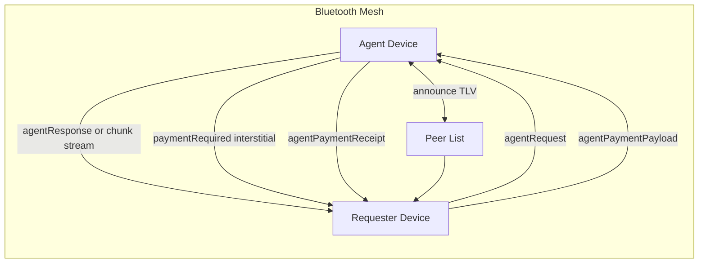

# Agent Mesh (Experimental)

This is the entrypoint documentation for the BitChat agent mesh feature.

Docs index:
- `docs/AGENT_MESH_PROTOCOL.md`
- `docs/AGENT_MESH_IMPLEMENTATION.md`
- `docs/AGENT_MESH_ROADMAP.md`
- `docs/AGENT_MESH_SETUP.md`

## Status
- Experimental; protocol and UX are still evolving.
- Runtime, retries, streaming, and payment-compatible packet schemas are in-tree.
- Phase 4A payment interstitial flow, Phase 4B settlement-room gossip, Phase 4C gateway proxy execution, Phase 4D per-token/tranche flow, Phase 4E fair-exchange encrypted release, Phase 4F notary hardening, and P2PK lock/relock hardening are in-tree.
- Phase 4G multi-rail baseline is partially in-tree (`paymentRail=x402`, requester opt-in gating, provider wizard x402 terms, guest-wallet bridge, gateway prepare/settle endpoints, and bridge-level x402 settlement path).
- Phase 6 session history, local memory controls, auto recall, and session payment-state UI are complete and in-tree.
- Phase 7 tiered quote routing is complete in-tree (`/agent` quote collection, tap or `/agentchoose` selection, quote-bound requests, auto-pick policies, provider tier configuration, and quote lifecycle cleanup).
- Phase 8 product readiness is complete in-tree (Settings IA, requester onboarding, provider wizard, wallet UI + mint allowlist consent, support bundle export, panic wipe).
- Trust/reputation mechanisms are intentionally deferred pending a dedicated privacy-first design and approval.

## Goals
- Discover agent-capable peers on mesh announce traffic.
- Route `/agent` requests to reachable peers with role + policy filtering.
- Return responses over Noise-encrypted payloads (single-shot or chunked).
- Support payment interstitials and payment packet exchange without breaking legacy clients.
- Preserve privacy and operate under BLE constraints.

## Non-goals (current)
- Centralized agent registry.
- Guaranteed global finality in fully partitioned offline networks.
- Completed trust weighting/reputation rollout.

## Quickstart (Developer)
1. On agent device:
   - `/agentset <role> <model> [quality] [hash]`
   - `/agenton`
   - `/agentconfig`
2. On requester device:
   - `/agent <role> <prompt>`
   - choose a quote via tap card (or `/agentchoose <quoteID> <optionIndex>`) when quotes are returned
3. Optional:
   - `/agentstream on`
   - `/agentwallet ...`
   - `/agentpay <requestID>` when payment is required

## High-Level Architecture
- Discovery:
  - `AgentInfo` is advertised in announce TLV `0x05`.
- Routing:
  - Candidate selection uses reachability, role, quality, and optional payment filters.
- Messaging:
  - Agent payloads are Noise payload types `0x20`-`0x28`.
- Runtime:
  - `AgentRuntime` supports echo/gateway execution and streaming adapter support.
- Payments:
  - Payment request/receipt interstitials are modeled in `AgentResponsePacket` and dedicated payment packets.
  - Cashu remains default/private rail; x402 is optional, online-only, and facilitator-dependent.

## Data Flow (Simplified)
1. Agent advertises `AgentInfo` (v1/v2).
2. Requester sends `AgentRequestPacket`.
3. Provider either:
   - returns response/chunks, or
   - returns `paymentRequired + paymentRequest`.
4. Requester sends `AgentPaymentPayloadPacket`.
5. Provider validates and emits `AgentPaymentReceiptPacket`.
6. Provider finalizes response flow.

## Current Constraint Notes
- Request/response TLV fields are 255-byte bounded per field.
- Payment and mint proxy payloads use TLV16 framing for larger payloads.
- Settlement-room nullifier broadcast is active (`#settle`, with optional `#settle-global` bridge when an internet relay path exists).
- Offline notary request/attestation gossip is active (`notary1:` payloads over mesh, with optional global bridge); provider-side k-of-n enforcement is configurable for offline acceptance.
- Settlement gossip only carries hashed nullifier signals; bearer proofs are never broadcast in rooms.
- X402 rails require an internet path and do not support offline acceptance.
- Trust weighting/reputation and incentive mechanisms remain deferred by design.

For implementation details, use:
- `docs/AGENT_MESH_IMPLEMENTATION.md`
- `docs/AGENT_MESH_PROTOCOL.md`
- `docs/AGENT_MESH_ROADMAP.md`
