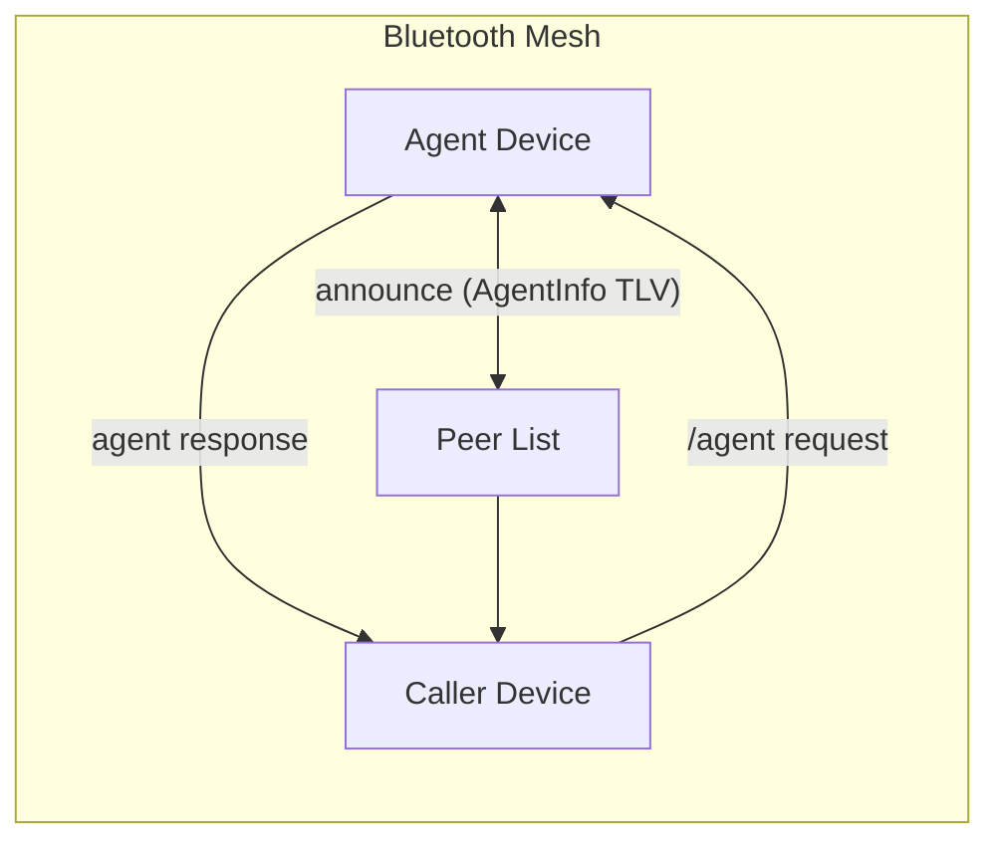
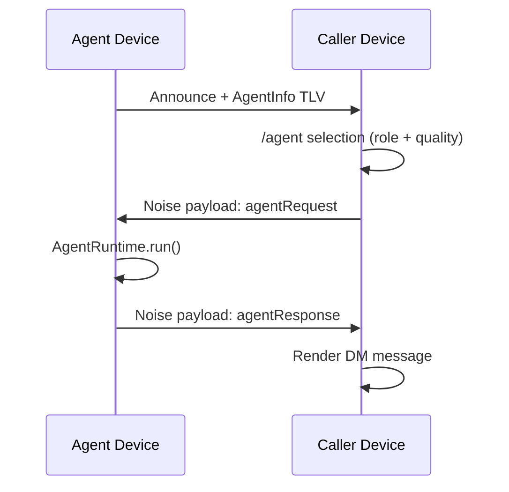

# Agent Mesh (Experimental)

This is the entrypoint documentation for the BitChat mesh agent feature. It is
written so a future engineer can understand the design, find the code, and
extend the system without re-deriving intent.

Docs index:
- docs/AGENT_MESH_PROTOCOL.md
- docs/AGENT_MESH_IMPLEMENTATION.md
- docs/AGENT_MESH_ROADMAP.md
- docs/AGENT_MESH_SETUP.md

## Status
- Experimental. Subject to protocol changes.
- Command-only configuration; no UI settings panel yet.
- Local agent runtime supports echo or an HTTP gateway, with defined integration points for LLMs.

## Goals
- Allow discovery of agent-capable peers on the Bluetooth mesh.
- Route /agent requests to a matching reachable peer.
- Return responses over the mesh via Noise-encrypted payloads.
- Keep the protocol compact and compatible with BLE constraints.

## Non-goals (current)
- Global agent registry or centralized discovery.
- Long-running multi-turn agent sessions.
- Payments or escrow (hooks are planned but not implemented).

## Quickstart (developer)
1) Enable local agent config:
   - /agentset <role> <model> [quality] [hash]
   - /agenton
   - /agentconfig
2) From another device on the mesh:
   - /agent <role> <prompt>
3) Observe the request + response in the private DM thread with the agent.

## High-Level Architecture
- Discovery:
  - Agents advertise AgentInfo via a new TLV on the announce packet.
- Routing:
  - Caller filters peers with agentInfo and selects a reachable match.
  - Highest quality score wins, with connection status as primary signal.
- Messaging:
  - Request + response are Noise payloads: agentRequest / agentResponse.
- Runtime:
  - AgentRuntime is a single function returning an AgentResponsePacket.
  - Current implementation is EchoAgentRuntime (for smoke tests).

## Data Flow (Sequence)
1) Agent-enabled device sends announce packets containing AgentInfo.
2) Caller executes /agent <role> <prompt>.
3) ChatViewModel selects best candidate and sends AgentRequestPacket.
4) Agent device receives agentRequest Noise payload.
5) AgentRuntime produces response content.
6) Agent device sends AgentResponsePacket back over mesh.
7) Caller displays response in the private DM thread.

## Config Surface (Current)
Slash commands:
- /agent <role> <prompt>
- /agentconfig
- /agentset <role> <model> [quality] [hash]
- /agenton / /agentoff
- /agentquality <0-100>
- /agentruntime <echo|gateway>
- /agentgateway <url>
- /agenttoken <token>
- /agenttimeout <seconds>
- /agenttimeout <seconds>

Persistence:
- UserDefaults key: bitchat.agent.config
- Stored as JSON-encoded AgentConfig.

## Constraints and Limits
- Request and response TLVs currently cap role/model/prompt/content fields to 255 bytes.
- Response is single-shot (no streaming).
- No timeout or retry logic for agent requests.

## Change Summary (Implemented)
- Added AgentInfo and AgentConfig models.
- Extended AnnouncementPacket with agentInfo TLV.
- Added Noise payload types for agent request/response.
- Added AgentRequestPacket and AgentResponsePacket TLVs.
- Routed agent metadata through transport snapshots to peer list.
- Added /agent and config commands.
- Stubbed AgentRuntime for future LLM integration.

## Known Gaps (Intentional)
- No UI settings panel; command-only controls.
- No payments or invoice flow.
- No proof-of-quality or trust network.

For deeper details, see:
- docs/AGENT_MESH_PROTOCOL.md
- docs/AGENT_MESH_IMPLEMENTATION.md
- docs/AGENT_MESH_ROADMAP.md
