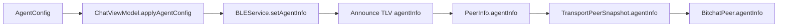

# Agent Mesh Implementation Guide

This document maps the codebase to the agent mesh feature and explains how to extend it safely.

## Code Map (Key Files)
- Models:
  - `bitchat/Models/AgentInfo.swift`
  - `bitchat/Models/AgentSession.swift`
  - `bitchat/Models/AgentSessionAttachment.swift`
  - `bitchat/Models/AgentRuntimeStatus.swift`
- Protocol:
  - `bitchat/Protocols/AgentMeshConstants.swift`
  - `bitchat/Protocols/BitchatProtocol.swift`
  - `bitchat/Protocols/Packets.swift`
- Core services:
  - `bitchat/Services/AgentCatalogService.swift`
  - `bitchat/Services/AgentKnownModelCatalog.swift`
  - `bitchat/Services/AgentKnownModelUpdateService.swift`
  - `bitchat/Services/AgentRequesterPreferences.swift`
  - `bitchat/Services/AgentRuntime.swift`
  - `bitchat/Services/AgentGatewayClient.swift`
  - `bitchat/Services/GatewayAgentRuntime.swift`
  - `bitchat/Services/AgentMeshFeatureFlags.swift`
  - `bitchat/Services/AgentMeshLogger.swift`
  - `bitchat/Services/AgentRetryQueue.swift`
  - `bitchat/Services/AgentMeshChunker.swift`
  - `bitchat/Services/AgentResponseAssembler.swift`
  - `bitchat/Services/AgentSessionStore.swift`
  - `bitchat/Services/AgentMemoryStore.swift`
  - `bitchat/Services/AgentMemoryRecall.swift`
- Payment services:
  - `bitchat/Services/AgentPaymentBridge.swift`
  - `bitchat/Services/AgentPaymentStore.swift`
  - `bitchat/Services/AgentPaymentLockKeyStore.swift`
  - `bitchat/Services/AgentPaymentFilter.swift`
  - `bitchat/Services/WalletNotifications.swift`
  - `bitchat/Services/AgentPaymentNotaryService.swift`
  - `bitchat/Services/AgentFairExchangeService.swift`
  - `bitchat/Services/AgentSettlementGossip.swift`
  - `bitchat/Services/CashuModels.swift`
  - `bitchat/Services/CashuP2PKService.swift`
  - `bitchat/Services/CashuWalletService.swift`
  - `bitchat/Services/CashuMintClient.swift`
  - `bitchat/Services/X402Models.swift`
  - `bitchat/Services/X402GatewayClient.swift`
  - `bitchat/Services/ThirdwebGuestWalletBridge.swift`
  - `bitchat/Services/MintGatewayService.swift`
- ViewModel entrypoints:
  - `bitchat/ViewModels/ChatViewModel.swift`
  - `bitchat/ViewModels/Extensions/ChatViewModel+AgentMeshRequests.swift`
  - `bitchat/ViewModels/Extensions/ChatViewModel+AgentMeshStreaming.swift`
  - `bitchat/ViewModels/Extensions/ChatViewModel+AgentMeshPayments.swift`
  - `bitchat/ViewModels/Extensions/ChatViewModel+AgentMeshQuotes.swift`
  - `bitchat/ViewModels/Extensions/ChatViewModel+AgentSessions.swift`
  - `bitchat/ViewModels/Extensions/ChatViewModel+AgentMemory.swift`
  - `bitchat/ViewModels/Extensions/ChatViewModel+AgentRoutingPreferences.swift`
  - `bitchat/ViewModels/Extensions/ChatViewModel+AgentMeshUI.swift`
- UI:
  - `bitchat/Views/Settings/SettingsRootView.swift`
  - `bitchat/Views/Settings/RequesterPreferencesSettingsView.swift`
  - `bitchat/Views/Wallet/WalletView.swift`
  - `bitchat/Views/Wallet/MintAllowlistView.swift`
  - `bitchat/Views/Onboarding/OnboardingFlowView.swift`
  - `bitchat/Views/Onboarding/ProviderSetupWizardView.swift`
  - `bitchat/Views/AgentSettingsView.swift`
  - `bitchat/Views/AgentPreferencesView.swift`
  - `bitchat/Views/MeshPeerList.swift`
  - `bitchat/Views/SidebarSessionsView.swift`
- Tests:
  - `bitchatTests/Protocols/AgentMeshPacketsTests.swift`
  - `bitchatTests/Services/AgentFairExchangeServiceTests.swift`
  - `bitchatTests/Services/AgentKnownModelCatalogTests.swift`
  - `bitchatTests/AgentRequesterPreferencesTests.swift`
  - `bitchatTests/AgentRoutingPreferencesTests.swift`
  - `bitchatTests/Services/AgentPaymentStoreTests.swift`
  - `bitchatTests/Services/AgentPaymentBridgeTests.swift`
  - `bitchatTests/Services/AgentPaymentLockKeyStoreTests.swift`
  - `bitchatTests/Services/AgentPaymentNotaryServiceTests.swift`
  - `bitchatTests/Services/AgentSettlementGossipTests.swift`
  - `bitchatTests/Services/CashuModelsTests.swift`
  - `bitchatTests/Services/CashuWalletServiceNotificationTests.swift`
  - `bitchatTests/Services/ThirdwebGuestWalletBridgeTests.swift`
  - `bitchatTests/Services/X402ModelsTests.swift`
  - `bitchatTests/Services/MintGatewayServiceTests.swift`
  - `bitchatTests/Services/AgentMemoryStoreTests.swift`
  - `bitchatTests/Services/AgentMemoryRecallTests.swift`
  - `bitchatTests/Services/AgentSessionStoreTests.swift`
  - `bitchatTests/ChatViewModelPaymentsTests.swift`

## Discovery Flow
1. Local agent config is loaded from `UserDefaults`.
2. `ChatViewModel` applies `AgentInfo` to mesh service announce state.
3. Announce packets include `agentInfo` TLV (`0x05`).
4. Peers decode `agentInfo` and update transport snapshots.
5. UI renders agent-capable peers with role/model metadata.

## Request Lifecycle Flow
1. User sends `/agent <role> <prompt>`.
2. Routing filters peers by role, reachability, quality, known-model preferences, and optional payment filter.
3. For eligible per-request payment providers, requester sends quote discovery packets and receives tier options.
4. User selects an option by tap or `/agentchoose <quoteID> <optionIndex>`; optional auto-pick can select immediately after quote collection.
5. `AgentRequestPacket` is sent with optional `sessionID`, TTL fields, attachment metadata, and optional quote binding fields (`quoteID`, `quoteOptionID`).
6. Request state is tracked for timeout + retry (`AgentRetryQueue`), preserving quote binding on retries.
7. Receiver executes runtime or returns payment interstitial when required.

## Streaming and Assembly Flow
1. Provider can emit `AgentResponseChunkPacket` (`agentResponseChunk` payload type).
2. Receiver appends chunks into `AgentResponseAssembler`/stream buffers.
3. UI renders partial output incrementally and finalizes on `isFinal=true`.
4. Stalled streams can trigger request retry logic.

## Payment Interstitial Flow
1. Provider sends `AgentResponsePacket(paymentRequired=true, paymentRequest=...)`.
2. Requester records pending prompt and can pay via UI action or `/agentpay <requestID>`.
3. Requester sends `AgentPaymentPayloadPacket` (includes `sessionID` when present).
4. Provider validates payload via `AgentPaymentStore` idempotency checks.
5. Provider returns `AgentPaymentReceiptPacket` (`accepted_offline`, `finalized_online`, or `rejected`).
6. Session/payment UI state is updated from receipt status.
7. When fair exchange is active (4E), provider sends encrypted response offer chunks before payment and includes receipt unlock key so requester can decrypt deterministically.
8. When lock-required payment terms are active, requester relocks selected proofs to a per-request pubkey (direct mint path first, gateway relock fallback), and provider enforces fail-closed lock binding before offline/online acceptance.
9. For `paymentRail=x402`, requester builds `xpay:` payload using `ThirdwebGuestWalletBridge`, and provider settles via `X402GatewayClient` (`/x402/settle`).
10. Wallet UI reflects state transitions from payment operations via notification-driven updates (`cashuWalletDidUpdate`, `thirdwebWalletDidUpdate`) so balances/reservations and wallet-bridge context remain current without manual refresh.

## Settlement Gossip Flow (Phase 4B)
1. Provider acceptance path registers hashed nullifiers in `AgentSettlementGossip`.
2. Runtime emits settlement messages into mesh room `#settle` (`SpendAnnounce` or `SpendConflict`).
3. When internet relay path exists, runtime bridges to `#settle-global`.
4. Incoming payment payloads are pre-checked against observed nullifiers before bridge evaluation.
5. Conflicts are re-broadcast as conflict signals, not bearer proofs.

## Attachment Flow
1. User queues media before `/agent` send.
2. Request includes `attachmentCount` and `senderAlias`.
3. Attachments are transferred with `contextID = sessionID`.
4. Receiver waits for expected attachments, then invokes runtime.

## Session + Memory Flow (Phase 6)
1. Session history is persisted via `AgentSessionStore` and surfaced in the Sessions sidebar.
2. `/agentsession` commands can list/resume/new/end agent sessions.
3. Agent settings expose local memory files (`MEMORY.md`, daily logs) through `AgentMemoryStore`.
4. Manual attached memory snippets and optional auto-recall snippets are prepended to outgoing prompts locally.
5. Session rows track payment lifecycle state (`paid`, `accepted_offline`, `finalized`, `failed`).

## Config Surface (Slash Commands)
- `/agent <role> <prompt>`
- `/agentconfig`
- `/agentset <role> <model> [quality] [hash]`
- `/agenton` / `/agentoff`
- `/agentquality <0-100>`
- `/agentruntime <echo|gateway>`
- `/agentgateway <url>`
- `/agenttoken <token>`
- `/agenttimeout <seconds>`
- `/agentstream <on|off>`
- `/agentsession ...`
- `/agentchoose <quoteID> <optionIndex>`
- `/agentpay <requestID>`
- `/agentwallet ...`
- `/agentfilter ...`

## Known Limits (Current)
- Request/response TLV string fields are capped at 255 bytes.
- Chunk streaming is best-effort over lossy mesh transport.
- Payment payload/receipt packets, Phase 4A interstitial flow, Phase 4B settlement gossip, Phase 4C gateway proxy execution, Phase 4D per-token/tranche flow, Phase 4E fair-exchange encrypted release, Phase 4F notary hardening, and Phase 4 P2PK lock/relock hardening are in-tree.
- Multi-rail Phase 4G is partially in-tree: `paymentRail=x402` protocol/model wiring, requester preference gating, provider wizard x402 config, and bridge-level x402 request/payload/settlement flow are implemented.
- X402 flow depends on a reachable gateway/facilitator path and is online-only by design.
- `swift test` is expected to be green via `scripts/agent_mesh_test.sh`.
- Trust/reputation is intentionally deferred; Phase 7 tiered-quote routing and UX follow-ons are in-tree.

## Roadmap Status Snapshot
- Phase 0: Complete
- Phase 1: Complete
- Phase 2: Complete
- Phase 3: Complete
- Phase 4: Partial (4A + 4B + 4C + 4D + 4E + 4F-notary + P2PK hardening + 4G x402 baseline; reputation/incentives deferred)
- Phase 5: Deferred
- Phase 6: Complete
- Phase 7: Complete (tiered quote discovery, tap/command selection, auto-pick policies, provider tier config, and quote lifecycle cleanup)

## Not Yet Implemented (Later Phase 4 milestones)
- Reputation policy remains deferred pending privacy-first review.
- Incentive/capacity-payment policy remains optional and deferred.
- Attested model-quality proof remains out of scope (current `modelHash` is self-attested and identity-bound only).
- Production facilitator integration hardening (provider-specific upstream contracts/keys for x402 prepare+settle) is environment-specific and requires deployment-time configuration.

## Extension Points
### Runtime Integration
- Add/replace runtime providers in `AgentRuntime` and gateway adapters.

### Payment Rails
- Extend `AgentPaymentBridge` with additional rails while preserving `AgentPaymentPayloadPacket` semantics.

### Transport
- Any new transport must support agent request/response, chunk, payment payload/receipt, and mint proxy payload types.

### UI
- Expand payment/session controls in `AgentSettingsView` and chat action surfaces.

## Testing Checklist
- Protocol:
  - `AgentInfo v1/v2` encode/decode
  - request/response/chunk packet round-trips
  - payment payload/receipt and mint proxy round-trips
- Notifications/UI refresh:
  - Cashu wallet mutation emits `.cashuWalletDidUpdate` for import/reserve/commit/rollback/replace/resets.
  - Thirdweb bridge mutation emits `.thirdwebWalletDidUpdate` for ensure/pay/link/reset paths.
  - `WalletView` and payment prompt update while open without requiring re-open.
- Reliability:
  - TTL expiry removes pending request/payment state
  - retry queue flushes when peers become reachable
- Payments:
  - duplicate payload for same request is rejected
  - replay across different request IDs is rejected
- End-to-end:
  - payment interstitial pauses completion until receipt
  - streaming resumes cleanly after acceptance
