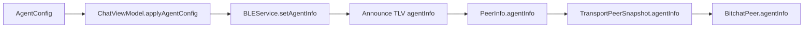
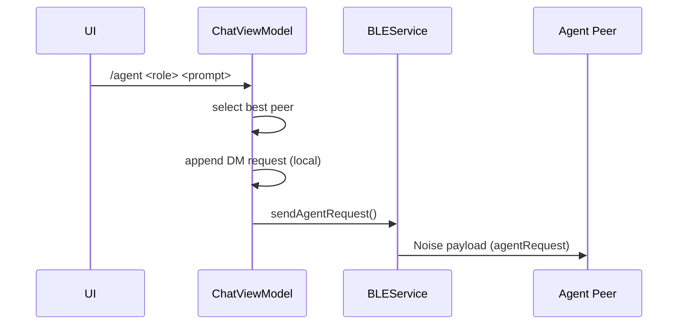
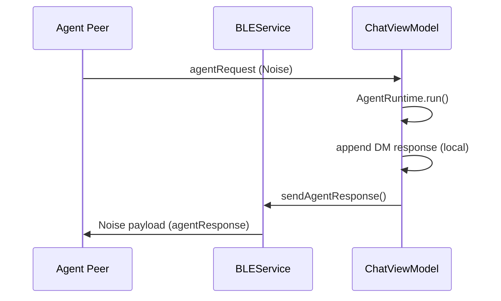

# Agent Mesh Implementation Guide

This document maps the codebase to the agent mesh feature and explains how to
extend it safely.

## Code Map (Key Files)
- Models:
  - bitchat/Models/AgentInfo.swift
  - bitchat/Models/BitchatPeer.swift
  - bitchat/Models/CommandInfo.swift
  - bitchat/Models/AgentSession.swift
- Protocol:
  - bitchat/Protocols/BitchatProtocol.swift
  - bitchat/Protocols/Packets.swift
  - bitchat/Protocols/AgentMeshConstants.swift
- Transport:
  - bitchat/Services/Transport.swift
  - bitchat/Services/BLE/BLEService.swift
  - bitchat/Services/UnifiedPeerService.swift
- Runtime:
  - bitchat/Services/AgentRuntime.swift
  - bitchat/Services/AgentGatewayClient.swift
  - bitchat/Services/GatewayAgentRuntime.swift
  - bitchat/Services/AgentMeshFeatureFlags.swift
  - bitchat/Services/AgentMeshLogger.swift
  - bitchat/Services/AgentMeshChunker.swift
  - bitchat/Services/AgentResponseAssembler.swift
- ViewModel:
  - bitchat/ViewModels/ChatViewModel.swift
  - bitchat/ViewModels/Extensions/ChatViewModel+AgentMeshUI.swift
  - bitchat/ViewModels/Extensions/ChatViewModel+AgentSessions.swift
- UI:
  - bitchat/Views/MeshPeerList.swift
  - bitchat/Services/AutocompleteService.swift
  - bitchat/Models/AgentRuntimeStatus.swift

## Discovery Flow
1) Local agent config is loaded from UserDefaults (bitchat.agent.config).
2) ChatViewModel applies AgentInfo to BLEService via setAgentInfo().
3) BLEService includes agentInfo TLV on announce payloads.
4) Peers decode agentInfo and update PeerInfo.agentInfo.
5) TransportPeerSnapshot carries agentInfo into UnifiedPeerService and BitchatPeer.
6) UI shows a small agent icon for peers with agentInfo.

## Request Flow
1) User sends /agent <role> <prompt>.
2) CommandProcessor calls ChatViewModel.dispatchAgentRequest().
3) ChatViewModel filters peers with agentInfo and matches role.
4) It prefers connected peers, then reachable peers, then highest quality score.
5) It appends a local DM message for the request.
6) It sends AgentRequestPacket via Transport.sendAgentRequest().
7) BLEService wraps packet into Noise payload type agentRequest and sends it.

## Response Flow
1) Agent device receives Noise payload type agentRequest.
2) ChatViewModel.handleAgentRequest() validates role match.
3) AgentRuntime.run() produces an AgentResponsePacket + attachments.
4) BLEService sends agentResponse payloads back over the mesh (chunked if needed).
5) ChatViewModel.handleAgentResponse() reassembles chunks and renders a DM message in the agent thread.
6) Attachments are sent as file transfers with contextID = sessionID.

## Config Surface (Slash Commands)
- /agent <role> <prompt>
- /agentconfig
- /agentset <role> <model> [quality] [hash]
- /agenton /agentoff
- /agentquality <0-100>
- /agentruntime <echo|gateway>
- /agentgateway <url>
- /agenttoken <token>
- /agenttimeout <seconds>

## Known Limits (Current)
- request TLVs cap prompt to 255 bytes.
- responses are chunked into 255-byte TLVs and reassembled.
- no request timeout or retry.

## Extension Points
### LLM Runtime Integration
Replace EchoAgentRuntime with a real implementation:
- Local LLM: run a model in-process and return response text.
- Local gateway: call a Moltbot gateway or agent service.
- Remote API: call external LLM endpoint with auth + safety rules.

### Transport Changes
If future transport(s) are added, implement:
- sendAgentRequest()
- sendAgentResponse()
- agentInfo propagation in TransportPeerSnapshot

### UI Enhancements
- Add a dedicated settings screen for agent config.
- Show agent role/model/quality in peer list or profile view.

## Testing Checklist
- Single device:
  - /agentconfig returns current values.
  - /agentset + /agenton persists config.
- Two devices:
  - Agent device advertises role.
  - Caller sends /agent role prompt.
  - Request + response appear in the private DM thread (not mesh timeline).

## Debugging Tips
- Announce payloads are signed; unverified announces are ignored.
- If peers are not visible, verify Bluetooth state and mesh reachability.
- Agent selection uses peer list from UnifiedPeerService; confirm peer has agentInfo.
