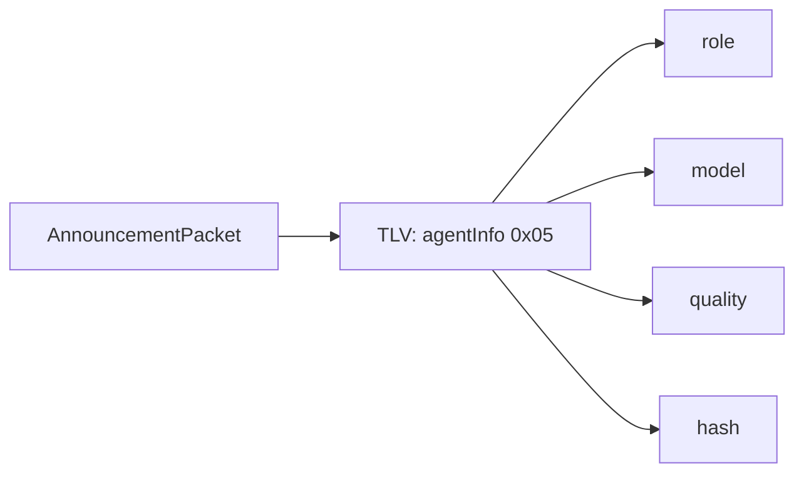
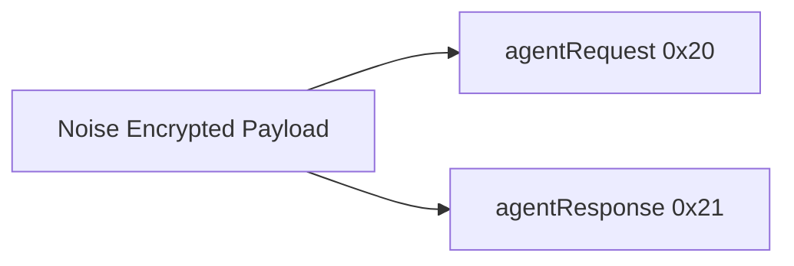

# Agent Mesh Protocol

This document describes protocol-level changes for mesh agents, including
announce TLVs and Noise payloads. All values are best-effort and may evolve.

## Compatibility and Versioning
- The agent TLV is optional and ignored by older clients.
- Unknown TLVs are skipped (tolerant decoder).
- AgentInfo blob includes a version byte for forward compatibility (see `AgentMeshConstants.agentInfoVersion`).

## Announcement TLV: agentInfo (0x05)
### Purpose
Advertise agent capability metadata during mesh discovery.

### Encoding
TLV type 0x05 contains a small versioned blob:
- [version:1]
- [roleLen:1][role:roleLen]
- [modelLen:1][model:modelLen]
- [quality:1]
- [hashLen:1][hash:hashLen]

### Field Notes
- role: string label for matching (case-insensitive comparison at runtime).
- model: model identifier (freeform string).
- quality: 0-100, caller prefers highest.
- hash: optional model hash or fingerprint (string).

### Limits
- Each string is capped to 255 bytes.
- If any field exceeds the limit, it is truncated or omitted.

## Noise Payload Types
Added to NoisePayloadType:
- 0x20 = agentRequest
- 0x21 = agentResponse

## AgentRequestPacket (TLV)
### Purpose
Send a single-shot agent request to a peer.

### Fields
- requestID (type 0x00): string
- role (type 0x01): string
- prompt (type 0x02): string
- sessionID (type 0x03): string (optional)

### Limits
- Each TLV value is capped to 255 bytes.
- Current encoder truncates prompt to 255 bytes.

## AgentResponsePacket (TLV)
### Purpose
Return a single-shot agent response to the requester.

### Fields
- requestID (type 0x00): string
- content (type 0x01): string
- isError (type 0x02): bool (1 byte, 0/1)
- sessionID (type 0x03): string (optional)
- chunkIndex (type 0x04): uint16 (optional, 1-based)
- chunkTotal (type 0x05): uint16 (optional)

### Limits
- content is capped to 255 bytes per chunk.
- If chunkIndex/chunkTotal are present, multiple responses are sent and reassembled.

## Routing Constraints
- Request/response payloads are Noise-encrypted.
- Peer selection favors reachability and quality score.
- No payment metadata yet (planned extension).

## Reserved Extensions (Planned)
- Payment metadata (invoice or address).
- Payment metadata (invoice or address).
- Trust attestations and quality proofs.
